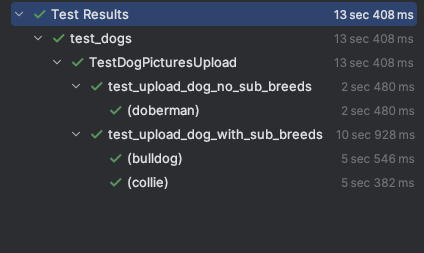

# Милые пёсики
У нас есть программа для загрузки [картинок собак](https://dog.ceo/dog-api/documentation). Для этой программы уже написан тест.  
На вход подается порода собаки. Функция находит одну случайную картинку этой собаки и загружает её на [Я.Диск](https://yandex.ru/dev/disk/poligon/).
Если у породы есть подпороды, то для каждой подпороды загружается по одной картинки.
Например, для doberman будет одна картинка, а для spaniel 7 картинок по одной на каждую подпороду.

# Задание:
Нужно перечислить 10 основных проблем в коде.  
Все найденные проблемы нужно отранжировать по критичности.

# Задание со звёздочкой:
Переписать код так, как Вы считаете нужным, исправив все проблемы.

## Предлагаемые исправления:
### Правки http-клиента:
1. **[High]** Методы YaUploader не возвращают значение. Добавил возврат response.json()

2. **[Medium]** Токен авторизации передается каждый раз вручную. Вынес токен как отдельную константу наружу,
   а в класс аплоадера передаю в качестве параметра конструктора, при этом дав ему значение по умолчанию. 
   Это позволяет создавать экземпляр класса аплоадера как без указания токена авторизации, так и с указанием токена,
   если предполагается использование аплоадера от имени разных пользователей

3. **[Medium]** Базовый урл для YaUploader имеет смысл вынести отдельно, а не указывать в каждом вызове.
   Можно оставить его в YaUploader'e как статическое поле класса, но я решил вынести в отдельный класс с базовыми урлами.
   В условиях, когда используется много http-клиентов, может возникать потребность иметь все базовые урлы в одном файле. 
   Также, если используется множество тестовых окружений,
   использование отдельного класса с урлами облегчит переключение между окружениями в тестах.
   
   Аналогично базовый урл dog-ceo.

4. **[Medium]** Яндексовый клиент унес в отдельный файл. Собачий клиент выделил в отдельный класс и тоже унес.
   Выделил для хттп клиентов отдельную директорию network

5. **[Low]** Хедеры в аплоадере используются одни и те же - Content-Type, Accept, Authorization.
   Вынес этот набор как приватное поле, которое вычисляется во время инициализации.

### Правки теста:
1. **[Critical]** Все тесты пишут в одну папку test_folder и не очищают ее. Это приводит к тому, что результаты предыдущих тестов ломают следующие.
   Также наборы параметров мешают друг другу. 
   Написал менеджер тестовых папок, который генерит уникальные названия, и запоминает те, что уже создал. 
   Написал фикстуру, которая в конце тестовой сессии удаляет все созданные папки, чтобы не засорять диск.

2. **[Critical]** После заливки фоток get_resource получает актуальное состояние не сразу.
    Нужно написать ожидалку, которая будет делать несколько ретраев в попытке дождаться желаемого результата.
    Либо просто сделать слип на 3-5 секунд, но это плохая практика

3. **[High]** Тест не использует блага YaUploader'а, определяя запросы каждый раз на месте. Исправил. 

4. **[High]** Убрал random.choice из списка пород с подпородами.
   Не стоит вносить элемент случайности в тест, т к тест должен быть предсказуем и выполнять понятный сценарий при каждом запуске.

5. **[Medium]** Переназвал фукцию u в upload_photos

6. **[Medium]** Выделил "response['_embedded']['items']" как отдельную переменную, чтобы улучшить читабельность кода

7. **[Medium]** Разделил тест на два: один проверяет породу без суб-пород, второй - породу с суб-породами.
   Считаю ветвление в тесте плохой практикой - по возможности стоит оформлять для разных веток отдельные кейсы,
   если это не влечет больших затрат на повторное прохождение сетапа теста. В данном случае этого не происходит.
   Но в целом это вопрос дискусионный, зависит от того, что принято в компании.

8. **[Medium]** Добавил функции upload_photos (бывшая u) параметр папки для загрузки

9. **[Low]** Убрал лишний вызов get_sub_breeds(breed) - достаточно это сделать один раз и пользоваться результатом.

10. **[Low]** Убрал из теста бесполезный assert True. Вреда не несет, но и пользы в нем нет.

11. **[Low]** Убрал слово proverka из имени теста. Смотрится чужеродно, смысла не несет, т к префикс test в имени имеет тот же смысл.

### Невошедшие правки:
1. Нужно добавить шаги для повышения читаемости кода. Самым распространенным решением является allure.
2. Добавить логирование хттп-запросов. Можно это делать отдельно для каждого запроса,
   но лучше сконфигурировать универсальный хттп-клиент, который будет логировать все запросы 
3. Проверка списка через for-each является не лучшей практикой.
   В таком виде встречая ошибку на середине списка, выполнение теста прекращается и теряется информация об остальных элементах.
   Лучше написать функцию, которая будет накапливать ошибки, итерируясь по списку, и в конце выдаст полный набор ошибок.

**Доказательноство успешного прохождения тестов**:\
